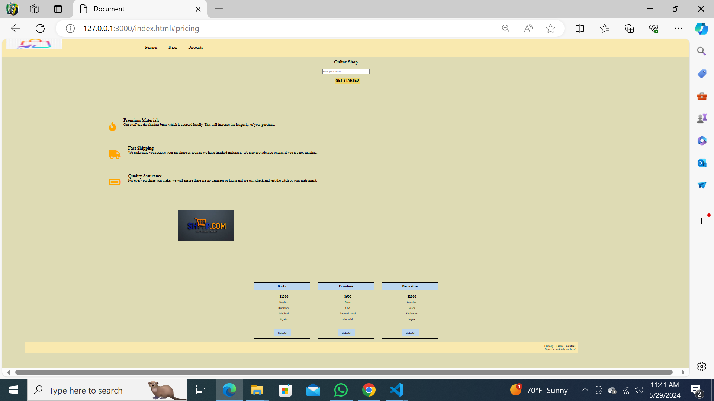

# Project Title 🚀
Landing_page

## Project Description 📝

> this project is useful for who want to creat a website for there works.

```html
<!--  </header>
     <body>
    <div id="header-option">
      <header id="header">
        <div class="logo">
          
```

```css
/* 

@media screen and (max-width: 600px) {
  body {
    background-color: rgb(72, 81, 84);
    display: block;
 */


## Demo 📸


## Technologies Used 🛠️

- HTML
- CSS


## Installation 💻

Provide step-by-step instructions on how to install and set up your project. Include any dependencies or prerequisites that need to be installed.

```bash
# git.
```

```bash
# github.
```

```bash
# vscode.
```

## Usage 🎯

```bash
# use git clone .
```

## Features ⭐

Examples:

- Feature 1- change background color when give it wihgt


## Author 👩‍💻
- Twitter: [@Latifa_Wakili](https://x.com/WakiliLatifa?t=wlHTh8JuyFprQsN_hZQGWQ&s=08)
- LinkedIn: [Latifa Wakili](https://www.linkedin.com/in/latifa-wakili-68423b277?utm_source=share&utm_campaign=share_via&utm_content=profile&utm_medium=android_app)
- Email: [example](saavenwakili@gmail.com)

## Contributing 🤝
for team working at first you should creat an organization on git hub nex you can creat pull_request on your project to shear whith your team and work on it together.

